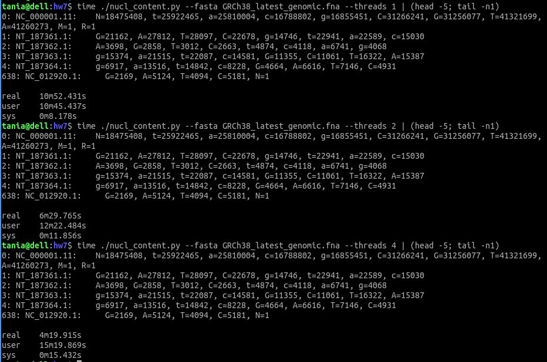
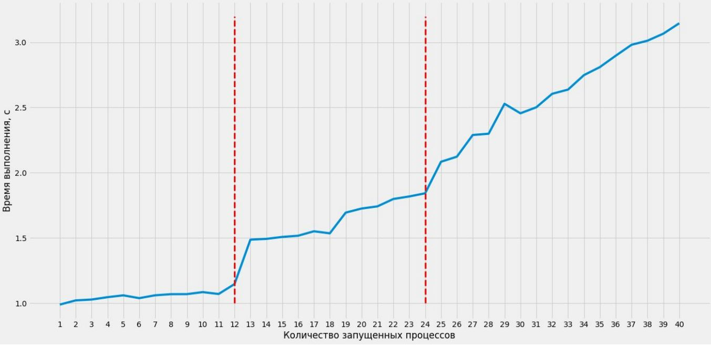

# HW7:  Parallel programming

Solving tasks for homework #7.

## 1. Overview

HW7 requires to solve 2 tasks:
1. create console programm that counts nucleotides in a big FASTA file,
   programm have to support parallel execution;
1. explain dependency of execution-time from the number of processes to execute.

Task 1 is in `nuc_content.py` and taske 2 is in `Interesting_plot.ipynb`

## 2. Requirements

Code was tested on Ubuntu 20.04, Python 3.8.10.
Necessary modules are listed in requirements.txt file.
To install them - need to run `pip install -r requirements.txt`.

## 3. Task 1 - parallel processing of FASTA file

I've choosed option #2 - parallel processing of big FASTA file. On my computer
this looks like CPU bound task - reading of file (IO task) faster than
count of nucleotides (CPU task). Therefore I decided to use multiprocessing.
This allows to use several CPU cores to count nucleotides and makes
file processing faster.

### 3.1 Processes
I splited all works to jobs (processes):
 * one main job - reads file, makes tasks for other jobs, combines results
 * working jobs - wait task and process it.

### 3.2 Interprocess communication
I do interprocess communication by multiprocessing.Queue(). It allows safely
exchange data between jobs (processes).
I use 2 queues:
 - TASK\_QUEUE   - to send tasks from main job to working jobs,
 - TASK\_RESULTS - to send task results from working jobs to main job.

### 3.3 Data structure
To store task data I use special data class (decorator dataclass)
with requested fields (task\_id, read\_id, seq\_id) and result field (task\_res).

```
@dataclass
class Task:
    '''
    Data class to store data for:
      - task request,
      - result string with amount of nucleotides.
    '''
    task_id: int    # id of task
    read_id: str    # read id
    read_seq: str   # read sequences
    task_res: str   # task result with amount of nucleotides
```

### 3.4 Application parameters
There are 3 parameters:
```
  -f, --fasta    - path to FASTA file for analysis, mandatory,
  -t, --threads  - number of processes (>=1), optional, default=1,
  -n, --nseq     - number of sequences to process, optional, default=all,
```
### 3.5 Example of script usage
```
  # process all file by 4 threads
  ./nucl_content.py --fasta GRCh38_latest_genomic.fna --threads 4

  # process first 20 sequences by 1 thread
  ./nucl_content.py --fasta GRCh38_latest_genomic.fna --threads 1 --nseq 20
```

### 3.6 Duration of execution for 1, 2 and 4 processes
Execution duration on my computer for 1, 2 and 4 processes you can see on this
picture.



## 4. Task 2 - dependency of execution-time from executed process

### 4.1 Задание
This task requires to explain dependency on the image:

### 4.2 In general
There are 3 areas:
* **parallel** - real CPU core execution (1-12 processes),
* **semi-parallel** - virtual CPU cores execution (13-24 processes),
* **sequential** - execution >1 processes on each virtual CPU cores.

More detailes you can find in Interesting\_plot.ipynb.